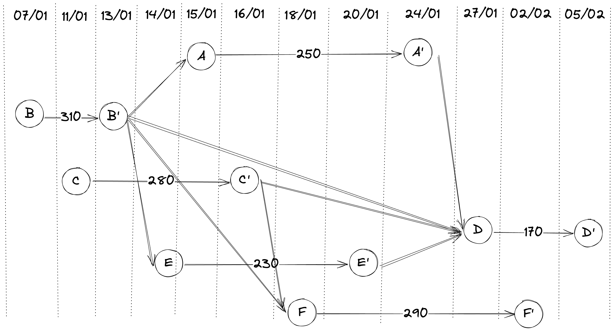
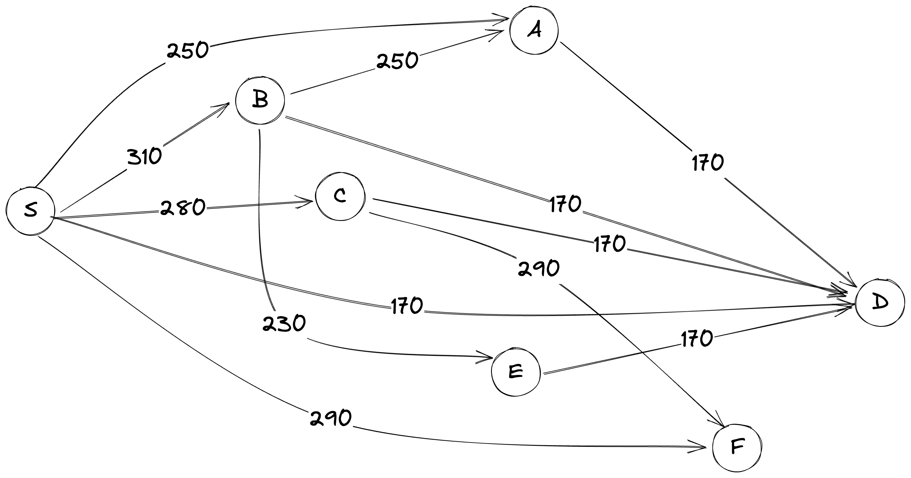
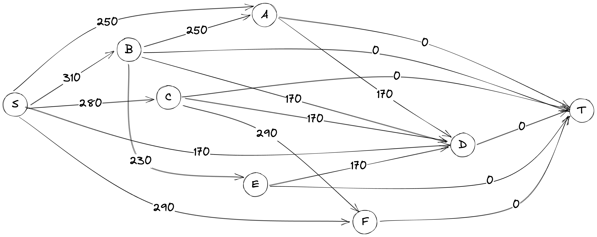
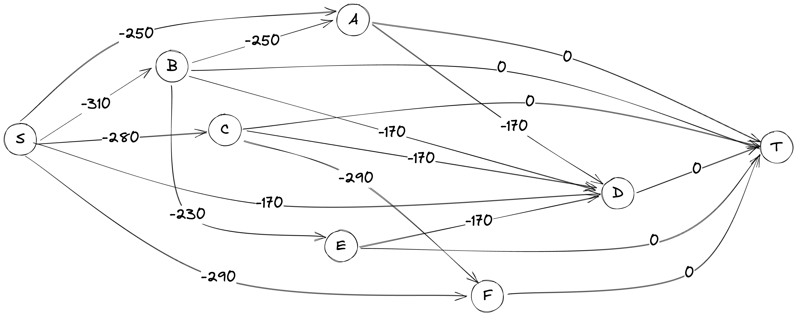

## Consigna

Somos dueños de una cabaña de alquiler turístico, que se alquila durante la temporada con el siguiente procedimiento. Hasta el 15 de diciembre, todos los interesados en alquilar la cabaña deben informar entre qué fechas quieren alquilar y qué monto están dispuestos a pagar. El 16 de diciembre informamos a los postulantes quiénes fueron aceptados. Por ejemplo, supongamos que recibimos las siguiente ofertas:

| Oferente |   Desde    |   Hasta    |   Oferta |
| :------- | :--------: | :--------: | -------: |
| A        | 15/01/2024 | 24/01/2024 | $250.000 |
| B        | 07/01/2024 | 13/01/2024 | $310.000 |
| C        | 11/01/2024 | 16/01/2024 | $280.000 |
| D        | 27/01/2024 | 05/02/2024 | $170.000 |
| E        | 14/01/2024 | 20/01/2024 | $230.000 |
| F        | 18/01/2024 | 02/02/2024 | $290.000 |

Dos ofertas son incompatibles si se superponen. Por ejemplo, para este juego de datos las ofertas A y C son incompatibles, mientras que las ofertas A y B no lo son. Para informar quiénes fueron aceptados, buscamos el subconjunto de ofertas compatibles entre sí que maximice nuestro ingreso total. Queremos resolver este problema formulándolo como un problema de camino mínimo en un grafo.


1. Modelar el problema con los datos de ejemplo de la tabla anterior como un problema de camino mínimo. Es decir, dar un grafo dirigido G con pesos en las aristas y nodos de origen y destino s y t, de modo tal que un camino mínimo en G entre s y t corresponda a una solución óptima del problema del alquiler para estos datos.

2. Explicar (con palabras) cómo se generaliza la idea del punto anterior para cualquier juego de datos.

## Tabla de contenidos

1. [Consigna](#consigna)
2. [Resolución](#resolución)
    1. [Modelando como un grafo de intervalos](#modelando-como-un-grafo-de-intervalos)
    2. [Refactorizando el grafo](#refactorizando-el-grafo)
    3. [Resolviendo como un problema de camino mínimo](#resolviendo-como-un-problema-de-camino-mínimo)
3. [Implementación](#implementación)


\newpage

## Resolución

### Modelando como un grafo de intervalos

Una primera aproximación es modelar el problema como un problema de máximizar la suma de las ofertas. Para ello, planteo un grafo dirigido en el que por cada oferente, se obtiene un nodo para su fecha "desde" y otro para su fecha "hasta". Por cada oferta, se crea una arista entre el nodo "desde" y el nodo "hasta" del oferente, con peso igual a la oferta, dirigido "desde" -> "hasta". Luego, para cada nodo de tipo "hasta" se crea una arista con peso $0$ hacia todos los nodos de tipo "desde" tal que la fecha "hasta" sea cronologicamente previa a la fecha "desde".

De esta forma obtenemos un grafo de la siguiente forma:




El problema a resolver entonces es encontrar un camino máximo en este grafo, tal que el costo total sea igual a la suma de las ofertas.

\newpage

### Refactorizando el grafo

A modo de implementación resulta mas simple modelar el grafo de tal forma de tener un solo nodo por oferente para reducir las aristas de peso nulo. Para esto, se crea un nodo para cada oferente, un nodo $S$ para el nodo de origen, y una arista desde $S$ hacia cada nodo de oferente con peso igual a su oferta. Luego, se crea una arista desde cada nodo oferente $N$ hacia todos los nodos oferentes $K$ cuya fecha "hasta" sea cronologicamente previa a la fecha "desde" de $N$ (es decir $N$ y $K$ son "compatibles"), con el peso de la oferta de $K$. De esta forma, llegar a un nodo de un oferente implica sumar el costo de su oferta, y al recorrer el gráfo se habrán considerado las ofertas de los nodos visitados.

$$
\begin{aligned} 
G &= (V, E) \\
V &= \{ S, A, B, C, D, E, F \} \\
E &= \{(S, N, O(N)) \text{  } \forall N \in V \text{  } | \text{  } N \neq S\} \\ 
    & \cup  \{ (N, K, O(K)) \text{  } \forall N, K \in V, \text{  } | \text{  } N \neq K,
    \text{ "hasta" } N < { "desde" } K \}
\end{aligned} 
$$

$$\text{ donde } O(N) = \text{oferta de } N$$



\newpage

Finalmente, se puede agregar un nodo $T$ para el nodo de destino, y una arista desde cada nodo oferente hasta $T$ con peso 0.



\newpage

### Resolviendo como un problema de camino mínimo

Una forma de ajustar los pesos de las aristas para que el problema sea equivalente a un problema de camino mínimo es multiplicar por -1 el peso de cada arista. De esta forma, el problema se convierte en encontrar el camino mínimo entre $T$ y $S$ en el grafo anterior.

$$
\begin{aligned} 
G &= (V, E) \\
V &= \{ S, A, B, C, D, E, F, T \} \\
E &= \{(S, N, -1 * O(N)) \text{  } \forall N \in V \text{  } | \text{  } N \neq I\} \\ 
    & \cup  \{ (N, K, -1 * O(K)) \text{  } \forall N, K \in V, \text{  } | \text{  } N \neq K, \text{ "hasta" } N < \text{ "desde" } K \} \\
    & \cup \{ (N, T, 0) \text{  } \forall N \in V, \text{  } | \text{  } N \neq I, N \neq T \} 
\end{aligned} 
$$

$$\text{ donde } O(N) = \text{oferta de } N$$

Algunos detalles a tener en cuenta es que el grafo resultante siempre va a contener un camino de $S$ a $T$, ya que el nodo $S$ tiene aristas dirigidas a todos los nodos de oferta, y el nodo $T$ tiene aristas dirigidas de todos los nodos de oferta. Además, el grafo resultante es acíclico, ya que las aristas de un nodo siempre van dirigidas a otro nodo con fecha "desde" posterior a la fecha "hasta" de dicho nodo.

De esta forma el grafo queda de la siguiente forma:



### Generalización

A cada nodo oferente se lo puede pensar como un invervalo de tiempo: [desde, hasta], mientras que a $S$ y $T$, por ser nodos de origen y destino, se los puede pensar como $[-\infty, min(desde)]$ y $[max(hasta), +\infty]$ respectivamente.
Por ejemplo, el nodo $A$ es el conjunto del intervalo $[15/01/2024, 24/01/2024]$.
Un intervalo de tiempo es compatible con otro si la intersección de ambos es vacía. Para esto habria que definir que existe la comparación _mayor que_ y _menor que_ entre fechas (por ejemplo, $15/01/2024 < 24/01/2024$). La intersección de intervalos es la misma que la intersección de conjuntos.

La idea es que el grafo resultante sea un grafo de compatibilidad, donde cada nodo es un intervalo de tiempo, y cada arista es una compatibilidad entre dos intervalos de tiempo, con peso igual a la oferta del nodo destino.

\newpage

## Implementación en Python

```{python}
import networkx as nx
from datetime import datetime
import matplotlib.pyplot as plt

info =    [ ["S", "01/01/2024", "01/01/2024", 0],
            ["A", "15/01/2024", "24/01/2024", 250],
            ["B", "07/01/2024", "13/01/2024", 310],
            ["C", "11/01/2024", "16/01/2024", 280],
            ["D", "27/01/2024", "05/02/2024", 170],
            ["E", "14/01/2024", "20/01/2024", 230],
            ["F", "18/01/2024", "02/02/2024", 290],
            ["T", "10/02/2024", "10/02/2024", 0]]

# Convertir las fechas a objetos datetime para poder compararlas

for i in info:
    i[1] = datetime.strptime(i[1], "%d/%m/%Y")
    i[2] = datetime.strptime(i[2], "%d/%m/%Y")

G = nx.DiGraph()

# Nodos

for i in info:
    G.add_node(i[0], start = i[1], end = i[2], cost = i[3])

# Ejes

for n in G.nodes:
    for m in G.nodes:
        if G.nodes[n]["end"] < G.nodes[m]["start"]:
            G.add_edge(n, m, weight = G.nodes[m]["cost"])

# Borro la arista que va de I a Z

G.remove_edge("S", "T")

# Graficar

pos = {}

starts = [G.nodes[n]["start"] for n in G.nodes]
ends = [G.nodes[n]["end"] for n in G.nodes]

first_date = min(starts)
last_date = max(ends)

def date_to_x(date):
    return (date - first_date).days

def key_to_y(key):
    return (len(G.nodes) - list(G.nodes).index(key))

for i, n in enumerate(G.nodes):
    pos[n] = (date_to_x(G.nodes[n]["start"]), key_to_y(n))

pos["S"] = (date_to_x(first_date) - 10, len(G.nodes)/2)
pos["T"] = (date_to_x(last_date) + 10, len(G.nodes)/2)

nx.draw_networkx_nodes(G, pos, node_size = 500)
_ = nx.draw_networkx_labels(G, pos)
_ = nx.draw_networkx_edges(G, pos, edgelist = G.edges, width = 1)
_ = nx.draw_networkx_edge_labels(G, pos, edge_labels = nx.get_edge_attributes(G, "weight"))

plt.show()
```
Camino más largo por costo.
```{python}
longest_path = nx.dag_longest_path(G)
longest_path_cost = nx.dag_longest_path_length(G) + G.nodes[longest_path[0]]["cost"]

longest_path, longest_path_cost

```

\newpage

Multiplico los pesos por -1 para poder usar un algoritmo de camino más corto.

```{python}
G_ = G.copy()

for e in G_.edges:
    G_[e[0]][e[1]]["weight"] *= -1

_ = nx.draw_networkx_nodes(G_, pos, node_size = 500)
_ = nx.draw_networkx_labels(G_, pos)
_ = nx.draw_networkx_edges(G_, pos, edgelist = G_.edges, width = 1)
_ = nx.draw_networkx_edge_labels(G_, pos, edge_labels = nx.get_edge_attributes(G_, "weight"))

plt.show()
```

Para obtener el camino más corto por costo se puede utilizar el algoritmo de Bellman-Ford ya que Dijkstra no funciona con pesos negativos.

```{python}
shortest_path = nx.bellman_ford_path(G_, "S", "T")
shortest_path_cost = nx.bellman_ford_path_length(G_, "S", "T") 
shortest_path_cost += G_.nodes[shortest_path[0]]["cost"]

shortest_path, -1 * shortest_path_cost
```
